# Лабораторні роботи №4 та №5: "Дослідження бойлерплейту бекенд-додатку" та "Розширення бекенд-додатку власними сутностями та реалізація REST API"

## Виконав: _Віктор Биков з групи ІПЗ 3.03_

### Опис проекту

Цей проект є частиною лабораторних робіт №4 та №5 і представляє з себе бекенд-додаток, взятий з [даного репозиторію](https://github.com/mkosir/typeorm-express-typescript), доповнений власними сутностями та реалізацією REST API для взаємодії з цими сутностями.

### Опис реалізованих сутностей

У рамках лабораторних робіт були реалізовані 3 пов'язані сутності, взяті з предметної області комп'ютерного клубу, що фігурує у курсовій роботі з дисципліни "Бази даних". Ось опис кожної з них:

1. **Client** - представляє клієнта комп'ютерного клубу з наступними полями:

- phone (Номер телефону клієнта та ідентифікатор сутності),
- full_name (Повне ім'я клієнта),
- birth (Дата народження клієнта).

2. **PC** - представляє комп'ютер у клубі з наступними полями:

- id (Унікальний ідентифікатор комп'ютера),
- cpu (Процесор комп'ютера),
- videocard (Відеокарта комп'ютера),
- ram (Обсяг оперативної пам'яті комп'ютера),
- hard_disc (Тип жорсткого диска комп'ютера),
- usb_amount (Кількість USB-портів на комп'ютері),
- os (Операційна система, встановлена на комп'ютері),
- buy_date (Дата придбання комп'ютера клубом).

3. **Session** - представляє сесію користування комп'ютером клієнтом з наступними полями:

- id (Унікальний ідентифікатор сесії),
- client_phone (Номер телефону клієнта, що є зовнішнім ключем до сутності Client),
- pc_id (Ідентифікатор комп'ютера, що є зовнішнім ключем до сутності PC),
- time (Час початку сесії),
- duration (Тривалість сесії),
- cost (Вартість сесії).

---

### REST API

Для кожної з реалізованих сутностей було створено наступні REST API ендпоінти:

1. **Client**
   - `GET /clients` - Отримати список усіх клієнтів.
   - `GET /clients/:phone` - Отримати інформацію про клієнта за номером телефону.
   - `POST /clients` - Створити нового клієнта.
   - `PATCH /clients/:phone` - Оновити інформацію про клієнта за номером телефону.
   - `DELETE /clients/:phone` - Видалити клієнта за номером телефону.
2. **PC**
   - `GET /pcs` - Отримати список усіх комп'ютерів.
   - `GET /pcs/:id` - Отримати інформацію про комп'ютер за його ідентифікатором.
   - `POST /pcs` - Створити новий комп'ютер.
   - `PATCH /pcs/:id` - Оновити інформацію про комп'ютер за його ідентифікатором.
   - `DELETE /pcs/:id` - Видалити комп'ютер за його ідентифікатором.
3. **Session**
   - `GET /sessions` - Отримати список усіх сесій.
   - `GET /sessions/:id` - Отримати інформацію про сесію за її ідентифікатором.
   - `POST /sessions` - Створити нову сесію.
   - `PATCH /sessions/:id` - Оновити інформацію про сесію за її ідентифікатором.
   - `DELETE /sessions/:id` - Видалити сесію за її ідентифікатором.

---

### Демонстрація роботи ендпоінтів

Для демонстрації роботи реалізованих ендпоінтів використовувався інструмент Postman. Було створено колекцію з прикладами запитів до кожного з ендпоінтів, що дозволяє легко перевірити їх функціональність.

**Колекція Postman**:

## 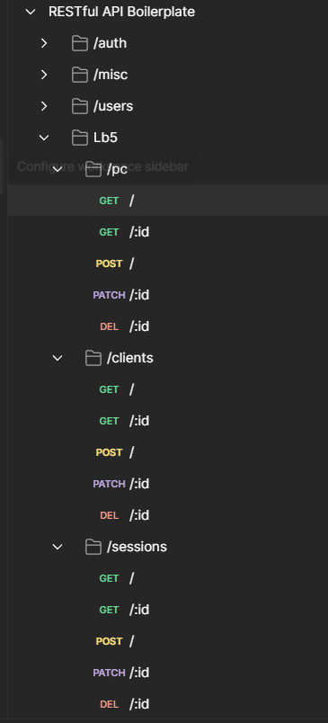

**Приклад додавання нового ПК**:

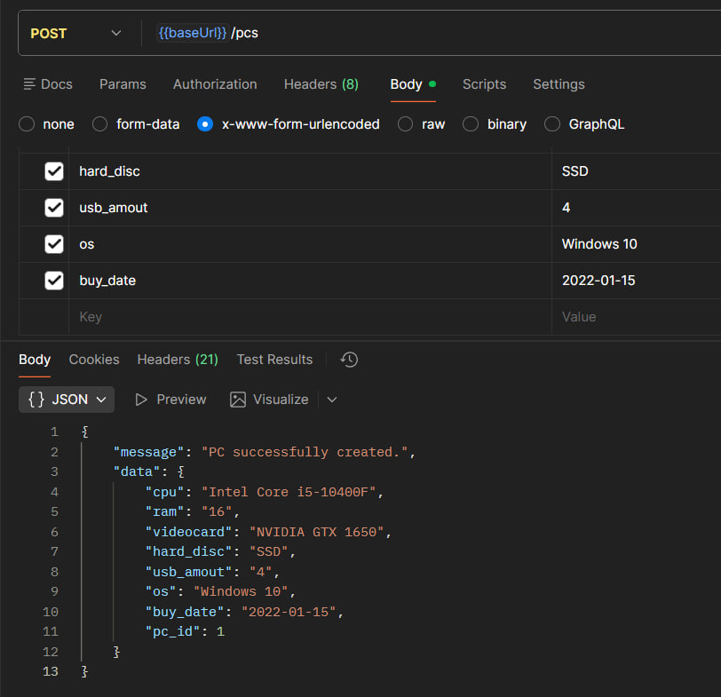

**Приклад отримання списку усіх ПК**:

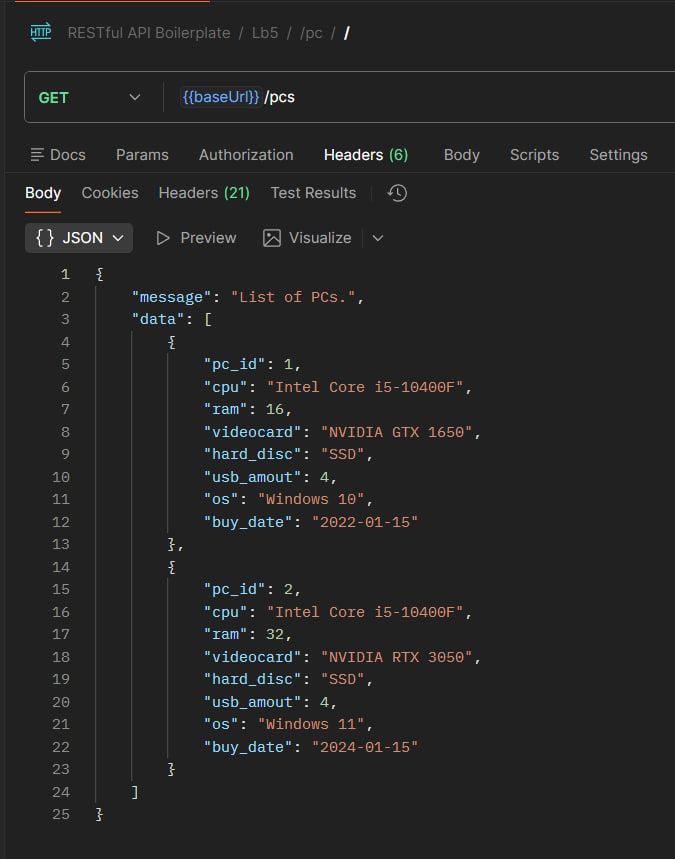

**Приклад отримання ПК за його ідентифікатором**:

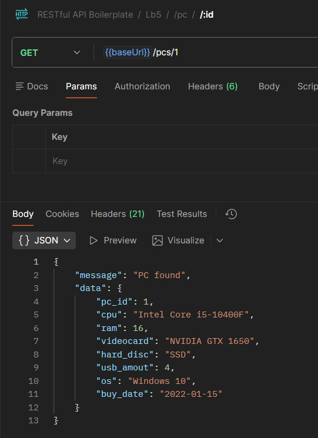

**Приклад оновлення інформації про ПК за його ідентифікатором**:

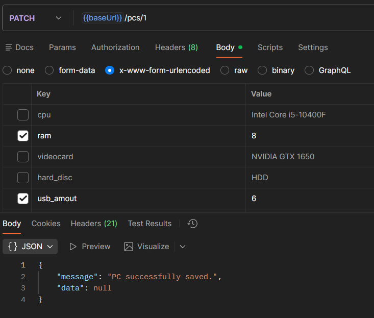

**Приклад видалення ПК за його ідентифікатором**:

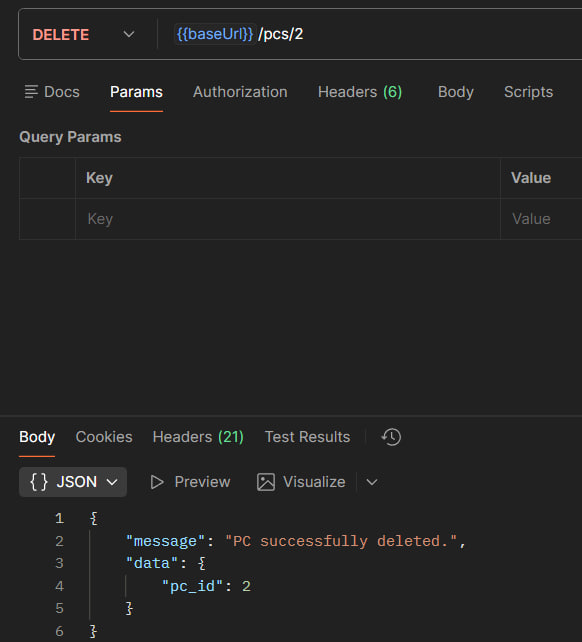

**Результат запитів на оновлення та видалення ПК**:

## 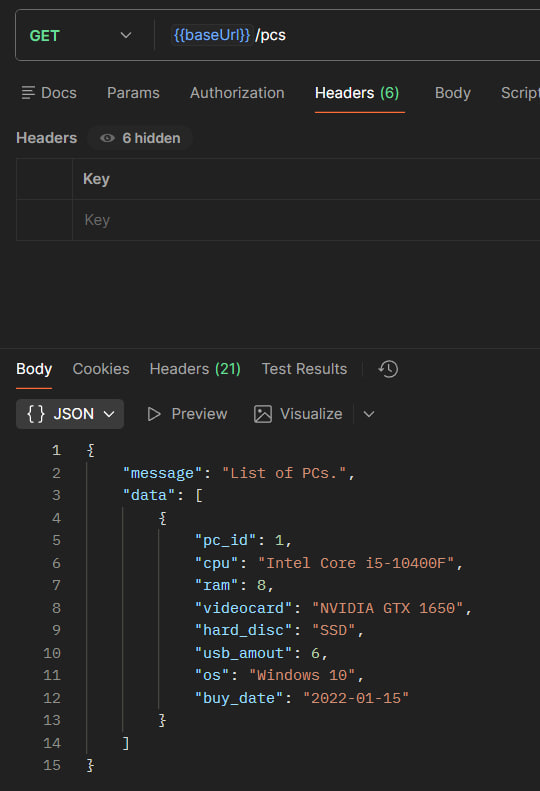

**Приклад додавання нового клієнта**:

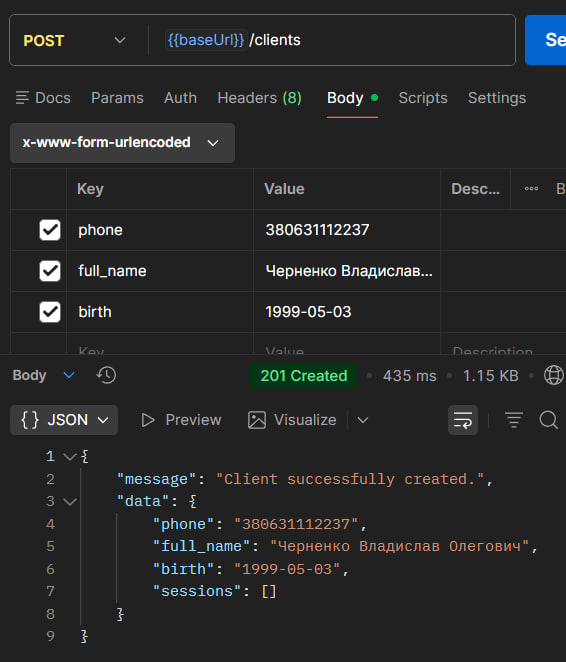

**Приклад отримання списку усіх клієнтів**:

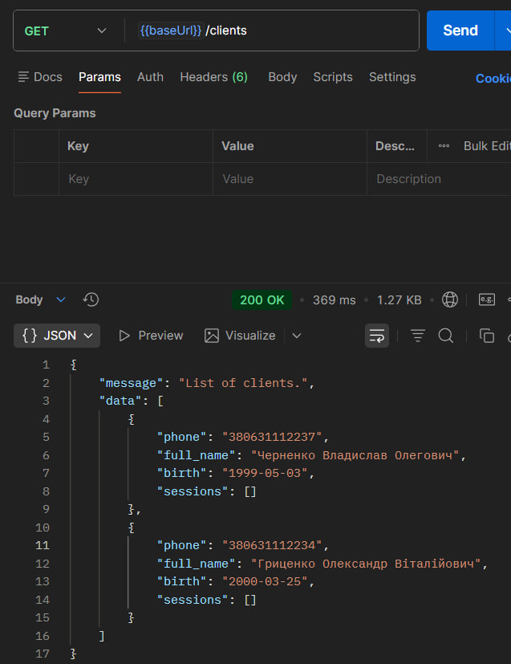

**Приклад отримання клієнта за номером телефону**:

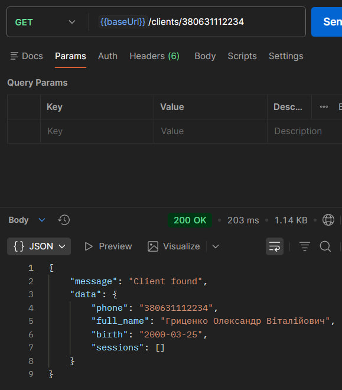

**Приклад оновлення інформації про клієнта за номером телефону**:


**Приклад видалення клієнта за номером телефону**:

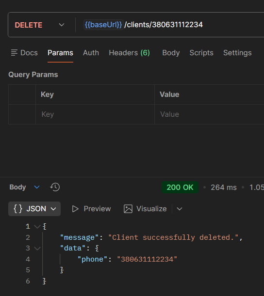

**Результат запитів на оновлення та видалення клієнта**:

## 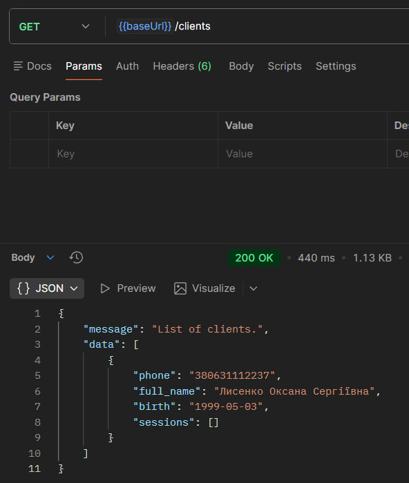

**Приклад додавання нової сесії**:

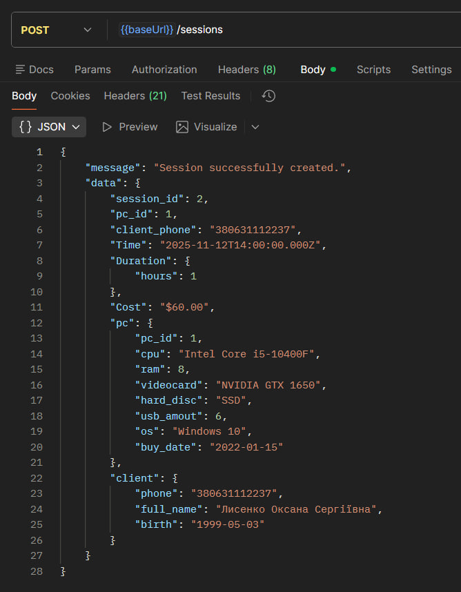

**Приклад отримання списку усіх сесій**:
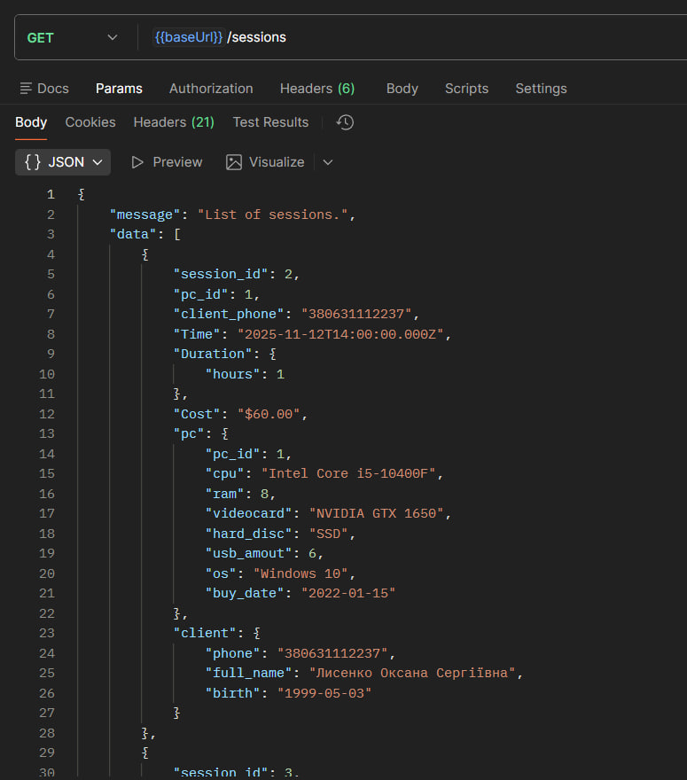
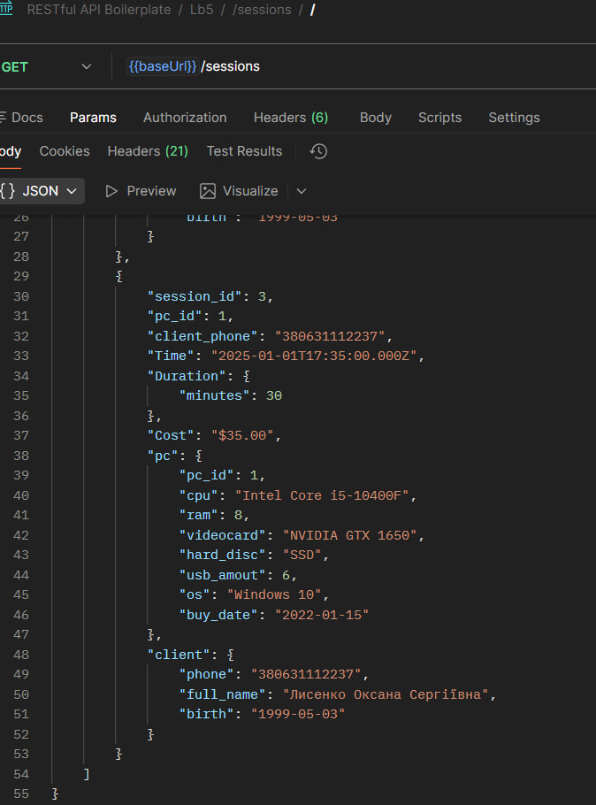

**Приклад отримання сесії за її ідентифікатором**:

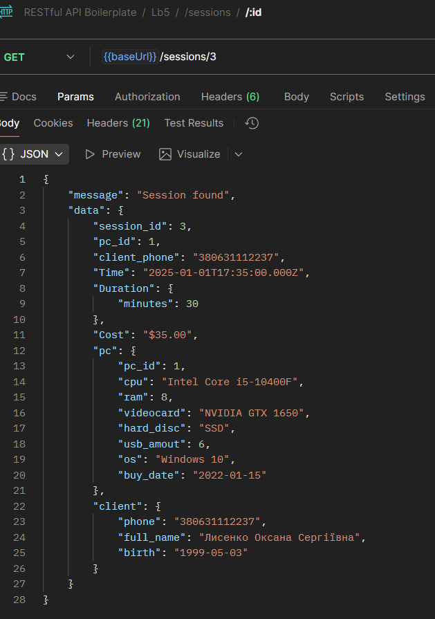

**Приклад оновлення інформації про сесію за її ідентифікатором**:

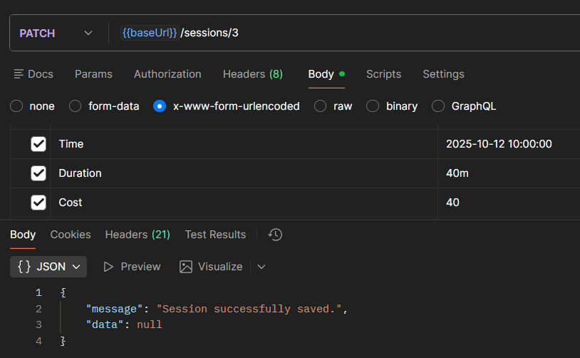

**Приклад видалення сесії за її ідентифікатором**:

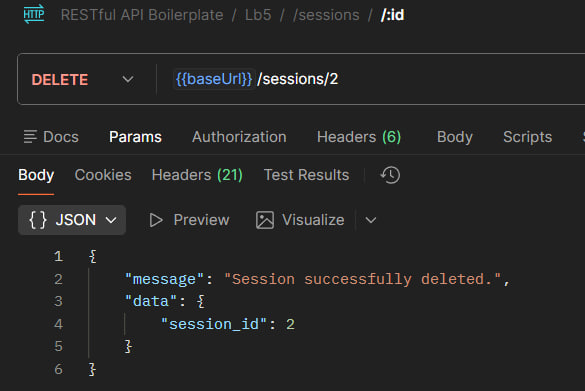

**Результат запитів на оновлення та видалення сесії**:

## 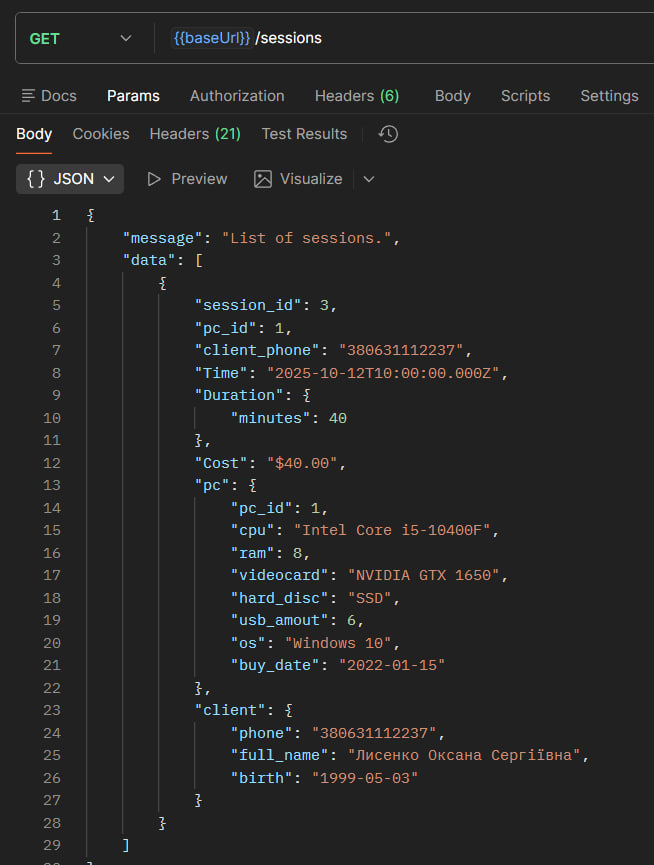

# Лабораторна робота №6: "Впровадження сервісного шару, валідації та DTO"

## Опис реалізованих змін

У рамках даної роботи у структуру проекту було впроваджено сервісний шар, middleware для валідації вхідних даних, а також використання DTO (Data Transfer Objects) для передачі даних між шарами додатку, та адаптовано контролери для роботи з цими нововведеннями.

---

### Сервісний шар

Сервісний шар був доданий для відокремлення бізнес-логіки від контролерів. Кожен контролер тепер викликає відповідні методи сервісів для виконання операцій над сутностями. Це дозволяє покращити організацію коду та полегшує тестування бізнес-логіки.

**Приклад сервіс-класу:**

```typescript
import { getRepository } from 'typeorm';

import { Client } from 'orm/entities/client/Client';
import { CustomError } from 'utils/response/custom-error/CustomError';

export class ClientService {
  private clientRepository = getRepository(Client);

  async findAll() {
    return this.clientRepository.find({ relations: ['sessions'] });
  }

  async findOne(phone: string) {
    const client = await this.clientRepository.findOne(phone, { relations: ['sessions'] });
    if (!client) {
      throw new CustomError(404, 'General', `Client with phone:${phone} not found.`, ['Client not found.']);
    }
    return client;
  }

  async create(data: Partial<Client>) {
    const client = this.clientRepository.create(data as Client);
    await this.clientRepository.save(client);
    return this.findOne(client.phone);
  }

  async update(phone: string, data: Partial<Client>) {
    const client = await this.findOne(phone);
    Object.assign(client, data);
    await this.clientRepository.save(client);
    return client;
  }

  async delete(phone: string) {
    const client = await this.findOne(phone);
    await this.clientRepository.delete(phone as any);
    return client;
  }
}
```

---

### Валідація вхідних даних

Для забезпечення коректності вхідних даних було реалізовано middleware, яке перевіряє дані, що надходять у запитах до API. Якщо дані не відповідають визначеним правилам валідації, сервер повертає відповідну помилку, що дозволяє уникнути некоректних операцій з базою даних.

**Приклад middleware для валідації:**

```typescript
import { Request, Response, NextFunction } from 'express';
import validator from 'validator';

import { CustomError } from 'utils/response/custom-error/CustomError';
import { ErrorValidation } from 'utils/response/custom-error/types';

export const validatorCreateClient = async (req: Request, res: Response, next: NextFunction) => {
  let { phone, full_name, birth } = req.body;
  const errorsValidation: ErrorValidation[] = [];

  phone = !phone ? '' : phone;
  full_name = !full_name ? '' : full_name;
  birth = !birth ? '' : birth;

  if (validator.isEmpty(phone)) {
    errorsValidation.push({ phone: 'Phone is required' });
  } else if (!validator.isLength(phone, { min: 1, max: 15 })) {
    errorsValidation.push({ phone: 'Phone must be at most 15 characters' });
  }

  if (validator.isEmpty(full_name)) {
    errorsValidation.push({ full_name: 'Full name is required' });
  }

  if (validator.isEmpty(birth)) {
    errorsValidation.push({ birth: 'Birth date is required' });
  } else if (!validator.isISO8601(birth)) {
    errorsValidation.push({ birth: 'Birth must be a valid date (ISO 8601)' });
  }

  if (errorsValidation.length !== 0) {
    const customError = new CustomError(
      400,
      'Validation',
      'Create Client validation error',
      null,
      null,
      errorsValidation,
    );
    return next(customError);
  }

  return next();
};
```

---

### Використання DTO

Для передачі даних між контролерами та сервісами були створені DTO (Data Transfer Objects). DTO дозволяють чітко визначити структуру даних, що передаються, та забезпечують додатковий рівень абстракції, що сприяє кращій організації коду.

**Приклад DTO:**

```typescript
import { Client } from 'orm/entities/client/Client';

export class ClientResponseDTO {
  phone: string;
  full_name: string;
  birth: string;
  sessions?: Array<{ session_id: number; Time: string; Duration: string; Cost: number; pc_id: number }>;

  constructor(entity: Client) {
    this.phone = entity.phone;
    this.full_name = entity.full_name;
    this.birth = entity.birth;
    if (entity.sessions && Array.isArray(entity.sessions)) {
      this.sessions = entity.sessions.map((s) => ({
        session_id: s.session_id,
        Time: s.Time,
        Duration: s.Duration,
        Cost: s.Cost,
        pc_id: s.pc_id,
      }));
    }
  }
}
```

---

### Адаптація контролерів

Контролери були адаптовані для роботи з новим сервісним шаром та DTO. Вони тепер відповідають лише за обробку HTTP-запитів та виклик відповідних сервісів, що покращує їх читабельність та підтримуваність.

**Приклад адаптованого контролера:**

```typescript
import { Request, Response, NextFunction } from 'express';

import { ClientService } from 'services/ClientService';
import { CustomError } from 'utils/response/custom-error/CustomError';

export const create = async (req: Request, res: Response, next: NextFunction) => {
  const { phone, full_name, birth } = req.body;
  const service = new ClientService();
  try {
    const client = await service.create({ phone, full_name, birth } as any);
    res.customSuccess(201, 'Client successfully created.', client);
  } catch (err) {
    const customError =
      err instanceof CustomError ? err : new CustomError(409, 'Raw', `Client can't be created.`, null, err);
    return next(customError);
  }
};
```

---

## Демонстрація роботи нововведень на прикладі запитів у Postman

### Невалідні запити:

**Створення ПК:**

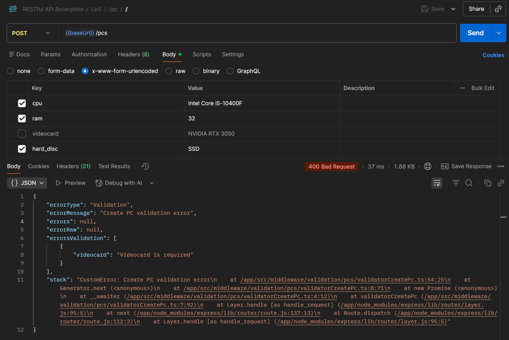

**Створення Клієнта:**

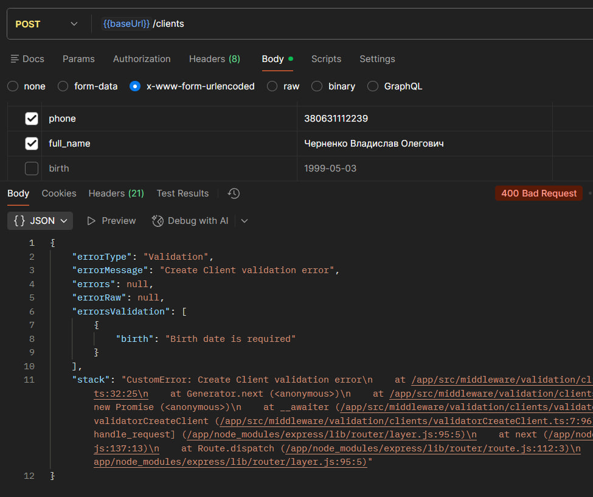

**Створення Сесії:**

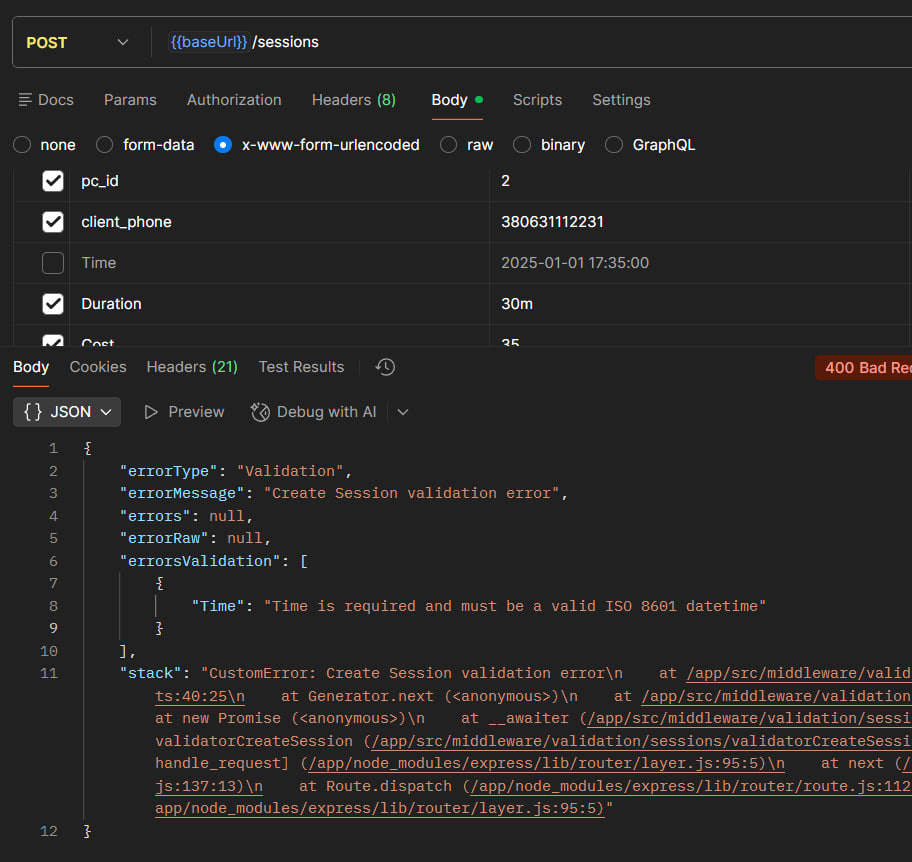

### Валідні запити:

**Створення ПК:**

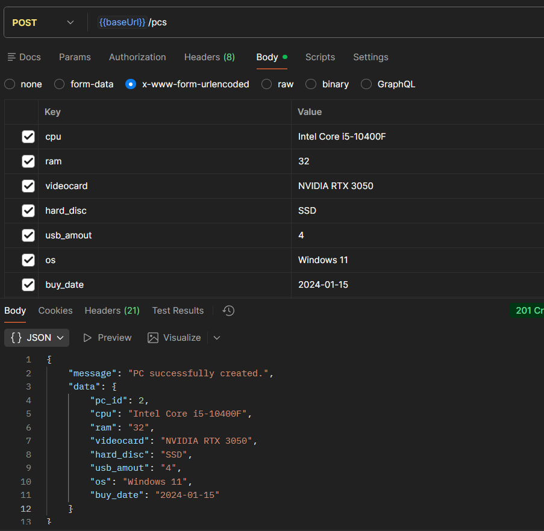

**Створення Клієнта:**

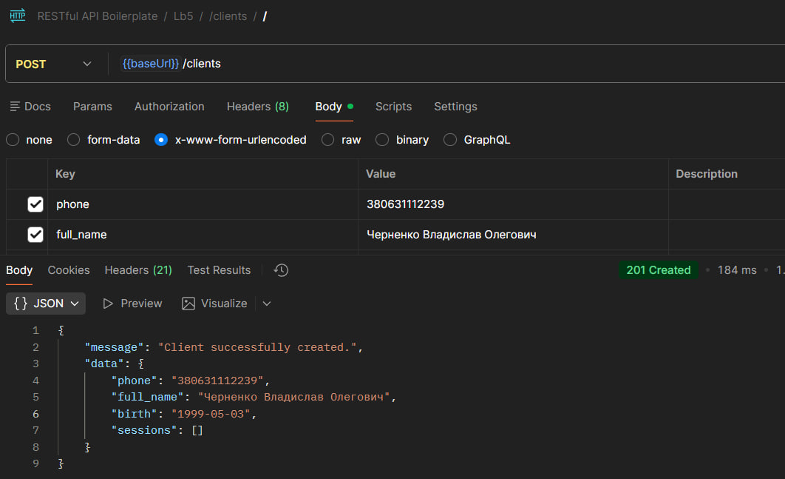

**Створення Сесії:**

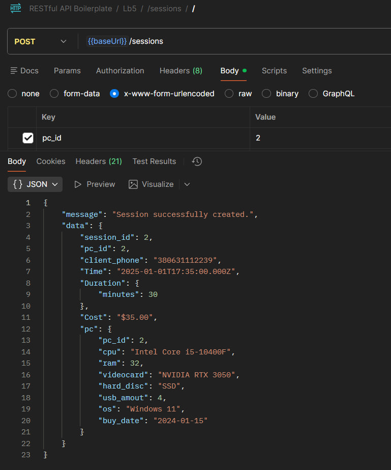
